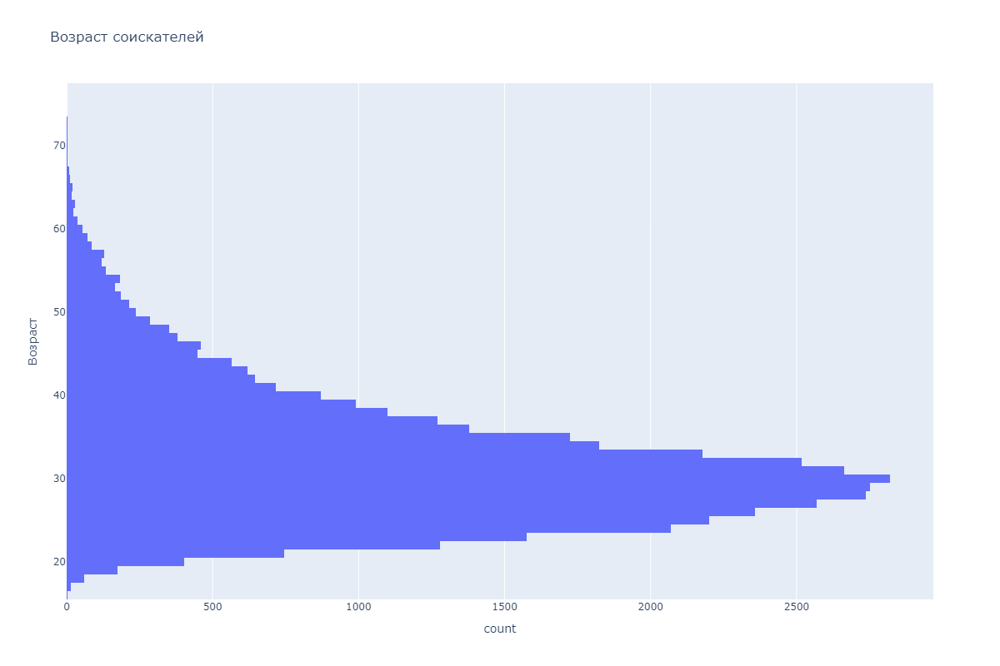
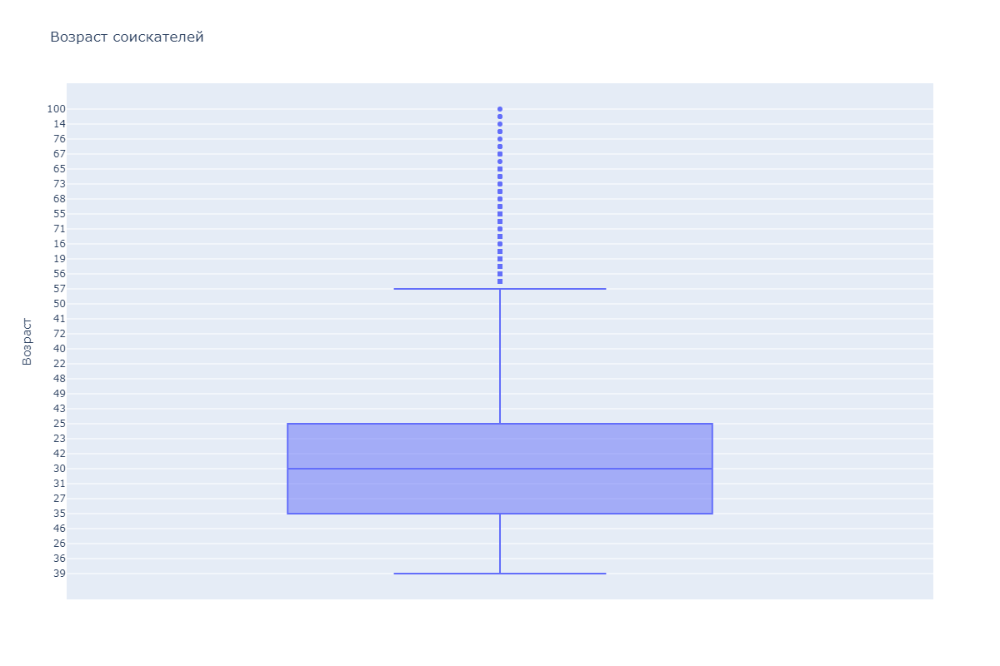
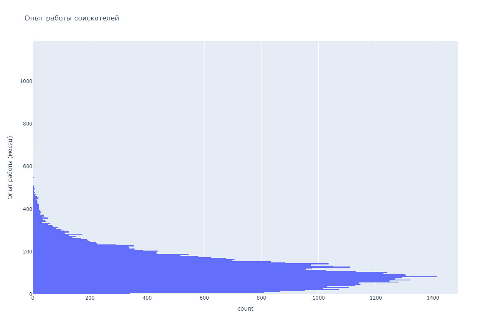
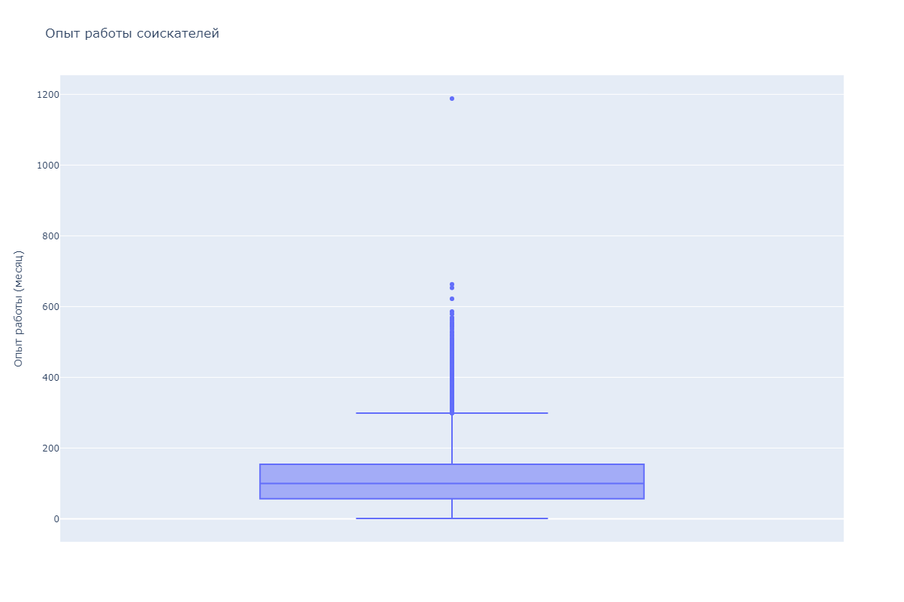
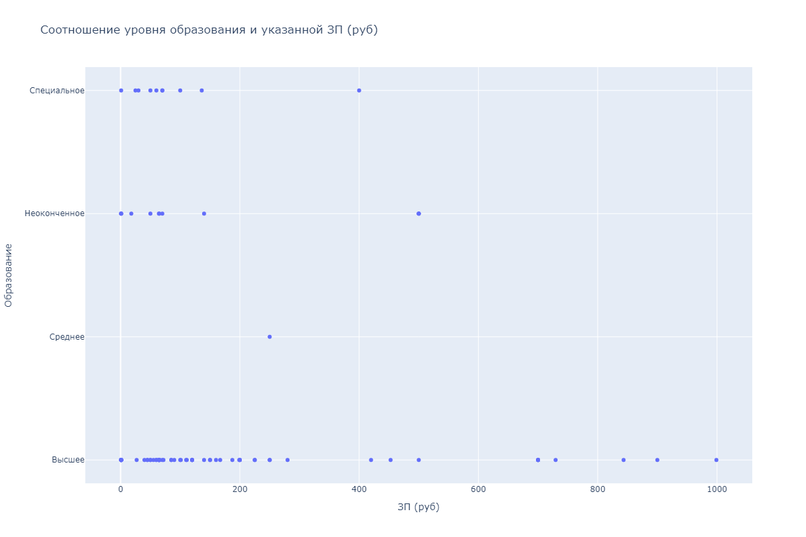

# hh-resume-analysis

Данные исследований: [ссылка на Google-диск](https://drive.google.com/drive/folders/1dHwpo3FHsecKPjJT5d8q1uzr_OW7UfhK?usp=drive_link)

Ноутбук с решением: [Анализ резюме из hh](Project-2.ipynb)

Гистрограмма зависимости возраста соискателей

Коробчатая диаграмма на наличие выбросов

основная часть соискателей от 24 до 30 лет\
к выбросам относятся возраст 14,15,100 и возможно 70,76
Гистограмма опыта работы соискателей

Коробчатая диаграмма на наличие выбросов

к выбросам можно отнести опыт работы от 600 месяцев\
поскольку обычно идут работать после 20\
в таком случае человеку уже 70 лет на момент поиска работы с опытом 600 месяцев, если принять, что ищут работу обычно с 20\
опыт работы большинства соискателей от 57 месяцев до 154
Соотношение уровня образования от уровня заработной платы

наименьшие запросы по ЗП для специального, среднего образования\
наибольшие - для высшего образования\
в текущих реалиях критерий все равно важен, так как на какие-то должности соискателей без высшего образования не рассматривают

