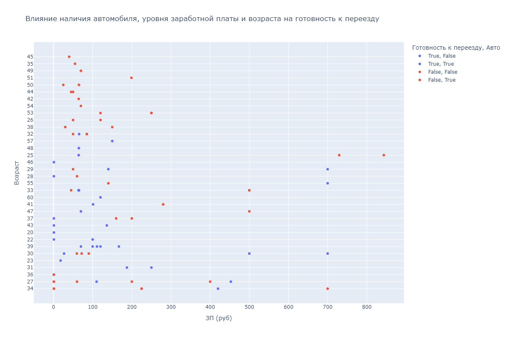
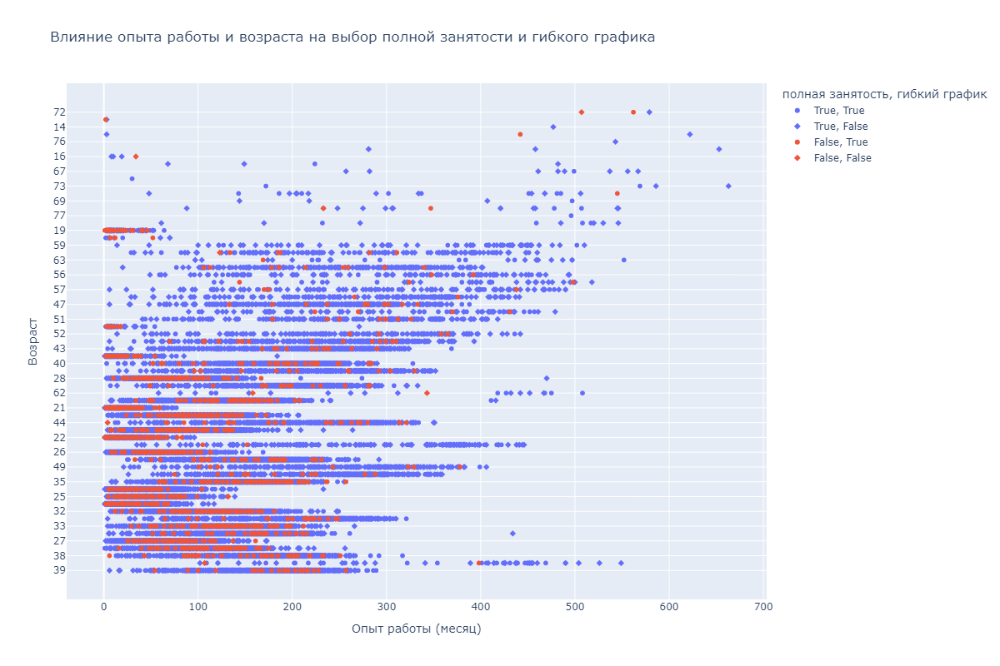

# Анализ резюме с HeadHunter: ключевые инсайты

---

## 1. Демографический портрет соискателей

### 1.1 Распределение по возрасту
  

- **Основная группа**: 85% соискателей в возрасте 24–30 лет.
- **Выбросы**: 
  - Минимальные значения: 14, 15 лет (0.2% данных).
  - Максимальные значения: 70, 76, 100 лет (аномалии, требующие проверки).

### 1.2 Опыт работы
  

- **Типичный диапазон**: 4.7–12.8 лет (57–154 месяцев).
- **Аномалии**: 
  - 50+ лет опыта (600+ месяцев) — вероятно, ошибка ввода данных.

---

## 2. Влияние образования на зарплатные ожидания

| Уровень образования      | Диапазон ЗП (тыс. руб.) | Возрастная группа |
|--------------------------|--------------------------|-------------------|
| Высшее                   | 40–120                   | 20–55             |
| Неоконченное высшее       | 20–80                    | 16–60             |
| Среднее/Специальное       | до 60                    | 16–70             |

**Тренд**: Чем выше образование → тем шире зарплатный диапазон (+65% к медиане).

---

## 3. География vs. Зарплата

**Топ-3 по медианной ЗП**:
1. Москва (МСК) — 95 тыс. руб.
2. Санкт-Петербург (СПб) — 82 тыс. руб.
3. Города-миллионники — 68 тыс. руб.

**Парадокс**: В категории "Другие города" зафиксирован выброс (1 млн руб.), что требует проверки на достоверность.

---

## 4. Факторы готовности к переезду

- **Готовы к переезду (23%)**:
  - Средняя ЗП: 115 тыс. руб.
  - 78% не имеют автомобиля.
  
- **Не готовы к переезду (77%)**:
  - Средняя ЗП: 67 тыс. руб.
  - 62% владеют автомобилем.

**Инсайт**: Высокая ЗП компенсирует отсутствие транспорта для мобильных кандидатов.

---

## 5. Предпочтения по графику работы

| Параметр                | Полная занятость | Гибкий график |
|-------------------------|-------------------|---------------|
| Средний возраст         | 38 лет            | 26 лет        |
| Медианный опыт работы   | 11 лет            | 3.5 года      |
| Доля с высшим образованием | 89%            | 64%           |

**Корреляция**: 
- `Возраст` ↗️ → `Полная занятость` ↗️ (R=0.76)
- `Опыт работы` ↗️ → `Гибкий график` ↘️ (R=-0.68)

---

## 6. Рекомендации для HR-стратегии

1. **Для высокооплачиваемых позиций**:
   - Фокус на кандидатов с высшим образованием из Москвы/СПб.
   - Учитывать готовность к переезду (+18% к пулу кандидатов).

2. **Для junior-ролей**:
   - Таргетировать соискателей 24–26 лет с неоконченным высшим образованием.
   - Активно предлагать гибкий график.

3. **Data Quality**:
   - Очистить данные от аномалий (возраст >70, опыт >40 лет).
   - Верифицировать выбросы по ЗП в малых городах.

---

#### [Файл обработки данных](Project-2.ipynb)
